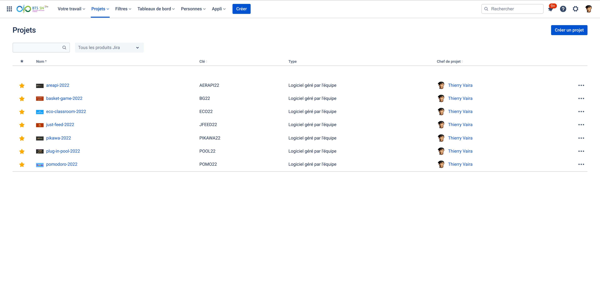
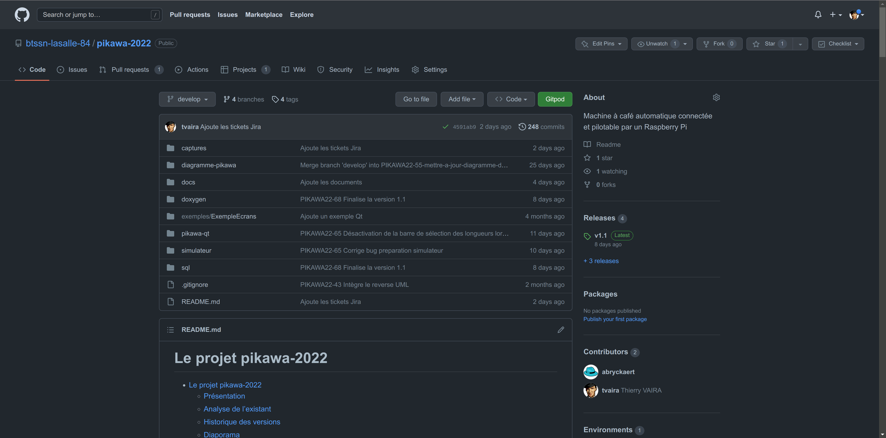
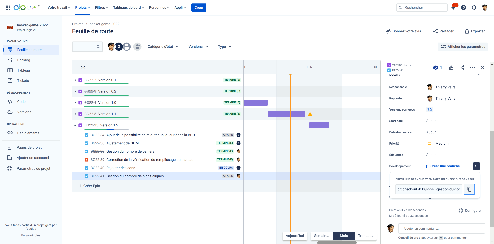
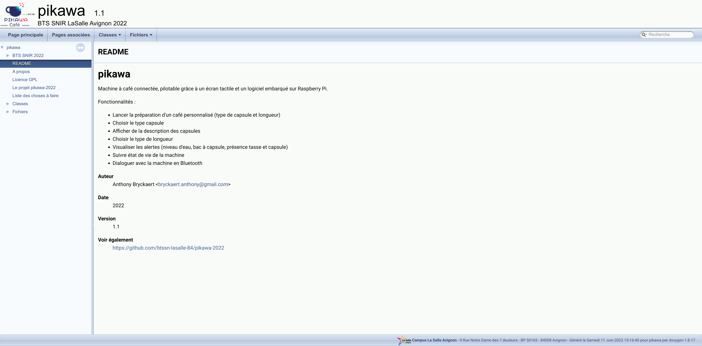

# Les projets BTS SN 2022

- [basket-game-2022](https://github.com/btssn-lasalle-84/basket-game-2022) : Système numérique dédié à la phase d'entraînement de basket-ball afin d'ajouter un aspect ludique et esprit de compétition
  - [Raspberry Pi Qt Version 1.1](https://github.com/btssn-lasalle-84/basket-game-2022/releases/tag/1.1) : Guillaume Lambert <<guillaumelambert45@gmail.com>>
  - [Diaporama Revue Finale]()
  - [Documentation du code](https://btssn-lasalle-84.github.io/basket-game-2022/)
  - [Kanban](https://github.com/btssn-lasalle-84/basket-game-2022/projects/1)

- [plug-in-pool-2022](https://github.com/btssn-lasalle-84/plug-in-pool-2022) : Système numérique permettant de jouer une partie de billard blackball
  - [Mobile Android Version 1.1](https://github.com/btssn-lasalle-84/plug-in-pool-2022/releases/tag/1.1) : Pierre Meras <<pierremeras@hotmail.fr>>
  - [Diaporama Revue Finale](https://github.com/btssn-lasalle-84/plug-in-pool-2022/blob/develop/docs/Diaporama%20Plug%20In%20Pool%20Revue%20Finale%20-%20Pierre%20MERAS.pptx)
  - [Documentation du code](https://btssn-lasalle-84.github.io/plug-in-pool-2022/)
  - [Kanban](https://github.com/btssn-lasalle-84/plug-in-pool-2022/projects/1)

- [pikawa-2022](https://github.com/btssn-lasalle-84/pikawa-2022) : Machine à café automatique connectée et pilotable par un Raspberry Pi
  - [Raspberry Pi Qt Version 1.1](https://github.com/btssn-lasalle-84/pikawa-2022/releases/tag/1.1) : Anthony Bryckaert <<bryckaert.anthony@gmail.com>>
  - [Diaporama Revue Finale]()
  - [Documentation du code](https://btssn-lasalle-84.github.io/pikawa-2022/)
  - [Kanban](https://github.com/btssn-lasalle-84/pikawa-2022/projects/1)

- [eco-classroom-2022](https://github.com/btssn-lasalle-84/eco-classroom-2022) : Supervision de salles dans un établissement scolaire
  - [Desktop Qt Version 1.1](https://github.com/btssn-lasalle-84/eco-classroom-2022/releases/tag/1.1) : Amine Zeryouhi <<aminzer2022@gmail.com>>
  - [Diaporama Revue Finale]()
  - [Documentation du code](https://btssn-lasalle-84.github.io/eco-classroom-2022/)
  - [Kanban](https://github.com/btssn-lasalle-84/eco-classroom-2022/projects/1)

- [pomodoro-2022](https://github.com/btssn-lasalle-84/pomodoro-2022) : Minuteur connecté pour la gestion de tâches
  - [Mobile Android Version 1.1](https://github.com/btssn-lasalle-84/pomodoro-2022/releases/tag/1.1) : Teddy Establet <<teddyestablet84@gmail.com>>
  - [Diaporama Revue Finale]()
  - [Documentation du code](https://btssn-lasalle-84.github.io/pomodoro-2022/)
  - [Kanban](https://github.com/btssn-lasalle-84/pomodoro-2022/projects/1)

- [areapi-2022](https://github.com/btssn-lasalle-84/areapi-2022) : Système d’assistance à l’arbitrage lors d’une partie de tennis de table en compétition
  - [Raspberry Pi Version 1.1](https://github.com/btssn-lasalle-84/areapi-2022/releases/tag/1.1) : Mathéo Bert <<bert.matheo2521@gmail.com>> et Enzo Ladriere <<enzo.ladriere.pro@gmail.com>>
  - [Diaporama Revue Finale]()
  - [Documentation du code](https://btssn-lasalle-84.github.io/areapi-2022/)
  - [Kanban](https://github.com/btssn-lasalle-84/areapi-2022/projects/1)

- [just-feed-2022](https://github.com/btssn-lasalle-84/just-feed-2022) : Surveiller à distance des distributeurs automatiques afin d’optimiser le processus de réapprovisionnement
  - [Desktop Qt Version 1.1](https://github.com/btssn-lasalle-84/just-feed-2022/releases/tag/1.1) : Laura MORELLO <<lauramorello1604@gmail.com>>
  - [Diaporama Revue Finale]()
  - [Documentation du code](https://btssn-lasalle-84.github.io/just-feed-2022/)
  - [Kanban](https://github.com/btssn-lasalle-84/just-feed-2022/projects/1)

Les projets sont gérés avec [Jira Software](https://btssn-avignon.atlassian.net/) et la méthode [Kanban](https://btssn-lasalle84.github.io/guides-developpement-logiciel/jira.html#ancre-kanban) :

Les projets sont versionnés avec [Git](https://btssn-lasalle84.github.io/guides-developpement-logiciel/premier-pas-git.html) et hébergés sur [GitHub](https://btssn-lasalle84.github.io/guides-developpement-logiciel/jira.html#_jira_et_github) et gérés avec le [workflow Gitflow](https://btssn-lasalle84.github.io/guides-developpement-logiciel/jira.html#ancre-gitflow) :

Les branches sont créées dans Jira à partir d’un ticket. Les fusions sont réalisées lors d’une revue de code en utilisant les Pull Requests dans GitHub :

Les projets sont documentés avec le générateur [Doxygen](https://btssn-lasalle84.github.io/guides-developpement-logiciel/guide-doxygen-btssn.html) :

©️ Thierry VAIRA <<thierry.vaira@gmail.com>> - LaSalle Avignon
